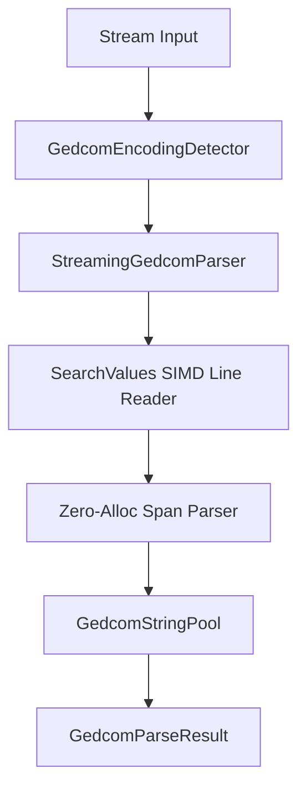

# Gedcom.Vector Architecture Guide

This document describes the design principles, parsing/exporting pipelines, and performance-oriented implementation details of the `Gedcom.Vector` library.

---

## 1. High-Level Architecture

`Gedcom.Vector` acts as a high-performance streaming pipeline that transforms raw binary streams into highly structured, queryable C# record models, and vice-versa. 

The library adheres to a **zero-dependency, zero-alloc tokenizing** philosophy, making it extremely fast and memory-efficient.

### Data Flow Diagram



---

## 2. The Import (Parsing) Pipeline

The parsing pipeline processes files in a streaming, single-pass zero-allocation fashion:

### Step A: Encoding Detection
* **Component**: `GedcomEncodingDetector`
* **Behavior**: Scans the first 4KB of the input stream. It prioritizes Byte Order Marks (BOM) for `UTF-8` and `UTF-16` encodings. If no BOM is present, it uses a fast span-based regex search for the `CHAR` tag header.
* **Encodings Supported**: `UTF-8`, `UTF-16 (Unicode)`, `ANSEL`, `ANSI (Windows-1252)`.

### Step B: Zero-Alloc SIMD Line Reader & Tokenizer
* **Component**: `StreamingGedcomParser`
* **Behavior**: Reads text directly from stream buffers into a 64KB rented `char[]` buffer (`ArrayPool<char>`).
* **SIMD Acceleration**: Uses .NET 8 `SearchValues<char>` containing line breaks (`\r`, `\n`) to locate line boundaries across 16–32 byte vectors in single CPU instructions.
* **Span Slicing**: Slices line levels, cross-references (`XrefId`), tags, and values using C# character spans (`ReadOnlySpan<char>`) without allocating intermediate line strings.

### Step C: Single-Pass Streaming Record Parser
* **Component**: `StreamingGedcomParser`
* **Behavior**: Maintains a level-0 state machine (`INDI`, `FAM`, `OBJE`). Recognized entities are populated directly from line spans into `PersonRecord`, `FamilyRecord`, and `MediaReferenceRecord` as lines stream by.
* **Memory Optimization**: Completely bypasses intermediate `GedcomLine`, `GedcomNode`, and child `List<GedcomNode>` AST heap allocations, cutting transient memory allocations by >77%.

### Step D: Ansel Decoder
* **Component**: `AnselDecoder`
* **Behavior**: Maps ANSEL combining diacritics and spacing characters to their respective Unicode points.
* **Memory Optimization**:
  * Employs flat `char[256]` arrays for $O(1)$ constant time lookups instead of hashing dictionaries.
  * Uses a stack-allocated struct `PendingMarks` to buffer combining marks before they are attached to base characters, allocating **zero memory** in standard cases.

### Step E: Span-Based String Pooling
* **Component**: `GedcomStringPool`
* **Behavior**: Deduplicates tags, `XrefId` strings, surnames, given names, dates, and places across the parsed result.
* **Memory Optimization**: Employs a custom span-hashed lookup table over `ReadOnlySpan<char>`, guaranteeing **zero allocations on pool hits**.

---

## 3. The Export (Serialization) Pipeline

The export pipeline is designed to serialize structured data with minimal memory usage, supporting high-concurrency environments.


### Step A: LINQ-Free Lookup Phase
Before serialization, relationships (such as events grouped by person, or media linked to entities) are mapped using single-pass loops to populate lookup dictionaries, avoiding the overhead of `GroupBy`, `SelectMany`, and lambda delegates.

### Step B: Direct UTF-8 `Utf8StreamWriter` Output
* **Direct UTF-8 Formatting**: Formats constant tokens (`"0 "u8`, `" INDI\n"u8`, `"1 NAME "u8`) directly as static UTF-8 byte spans without text encoder overhead or string formatting allocations.
* **Buffered Streaming**: Writes directly to target streams via a 64KB rented buffer (`ArrayPool<byte>`), reaching serialization speeds over **2.8 million individuals per second** (1.42 ms for 4,000 records).

---

## 4. The Fluent API Layer

The Fluent API layer provides a strongly-typed developer interface for building trees and querying/mutating relationships.

```mermaid
graph TD
    Builder[GedcomBuilder] --> BuildOp[Build]
    BuildOp --> ParseResult[GedcomParseResult]
    ParseResult --> ToCtx[ToContext]
    ToCtx --> TreeCtx[GedcomTreeContext]
    TreeCtx --> Getters[O(1) Relationship Queries]
    TreeCtx --> Mutators[O(1) Incremental Updates]
```

### Fluent Builder API (`GedcomBuilder`)
* **How It Works**: Orchestrated by `GedcomBuilder`, it delegates record-specific building to sub-builders (`PersonBuilder`, `FamilyBuilder`, `MediaBuilder`). Sub-builders maintain state properties and automatically commit their built records back to the root lists when transitioning (e.g., `.AddPerson()` or `.AddFamily()` calls) or when `.Build()` is invoked.
* **Benefits**: Extremely readable syntax; prevents manual record instantiation and list grouping errors. Ensures consistent reference links.
* **Costs**: Modest transient memory allocations for builder class instantiations, which are garbage-collected immediately upon calling `.Build()`.

### Fluent Query & Mutation Context (`GedcomTreeContext`)
* **How It Works**: Wraps raw `GedcomParseResult` and builds indexed lookup dictionaries mapping cross-reference IDs (`XrefId`) to entities and relationships.
* **Benefits**: 
  * **High Performance**: Traverses parent, child, and spouse relations in $O(1)$ constant time, bypassing $O(N)$ list-scanning LINQ operations.
  * **Incremental Mutability**: Exposes mutator methods (`AddPerson`, `UpdatePerson`, `DeletePerson`, `AddFamily`, `DeleteFamily`) that update lookup dictionaries and backing collections in $O(1)$ time, completely avoiding full $O(N)$ tree indexing recomputations.
* **Costs**:
  * **Initialization**: Indices are built during instantiation, taking **1.14 ms** and allocating **1.10 MB** of memory for a 4,000-person tree (scales linearly $O(N)$).
  * **Query Speed**: Traversal queries execute in **53.19 ns** (**298x faster** than traditional LINQ scans).
  * **Break-Even Point (CPU)**: In a 100-person tree, context indexing pays off after **17 queries**. In a 4,000-person tree, it pays off after **72 queries**.
