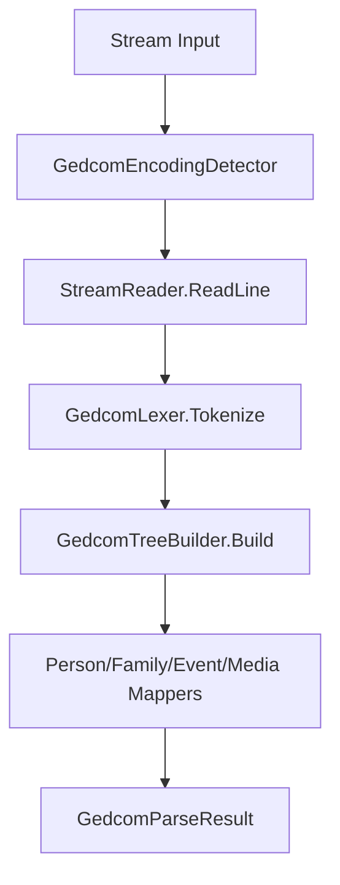
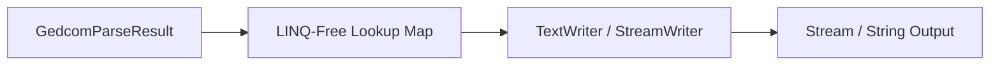

# Gedcom.Vector Architecture Guide

This document describes the design principles, parsing/exporting pipelines, and performance-oriented implementation details of the `Gedcom.Vector` library.

---

## 1. High-Level Architecture

`Gedcom.Vector` acts as a streaming pipeline that transforms raw binary streams into highly structured, queryable C# record models, and vice-versa. 

The library adheres to a **zero-dependency, low-allocation** philosophy, making it highly portable and memory-efficient.

### Data Flow Diagram

---

## 2. The Import (Parsing) Pipeline

The parsing pipeline processes files in a streaming, single-pass fashion:

### Step A: Encoding Detection
* **Component**: `GedcomEncodingDetector`
* **Behavior**: Scans the first 4KB of the input stream. It prioritizes Byte Order Marks (BOM) for `UTF-8` and `UTF-16` encodings. If no BOM is present, it uses a fast span-based regex search for the `CHAR` tag header.
* **Encodings Supported**: `UTF-8`, `UTF-16 (Unicode)`, `ANSEL`, `ANSI (Windows-1252)`.

### Step B: Tokenizer (Lexer)
* **Component**: `GedcomLexer`
* **Behavior**: Reads text lines, trims spacing, and parses components (`Level`, `XrefId`, `Tag`, `Value`) using C# character spans (`ReadOnlySpan<char>`).
* **Memory Optimization**:
  * Avoids regex objects during tokenization.
  * **Tag Interning**: If a tag matches a known GEDCOM tag literal (e.g., `INDI`, `NAME`), it returns a pre-allocated static string, reducing tag allocations by >99%.
  * Concatenation continuation tags (`CONC` and `CONT`) are accumulated into a `StringBuilder` and combined only when a new tag is found.

### Step C: Ansel Decoder
* **Component**: `AnselDecoder`
* **Behavior**: Maps ANSEL combining diacritics and spacing characters to their respective Unicode points.
* **Memory Optimization**:
  * Employs flat `char[256]` arrays for $O(1)$ constant time lookups instead of hashing dictionaries.
  * Uses a stack-allocated struct `PendingMarks` to buffer combining marks before they are attached to base characters, allocating **zero memory** in standard cases.

### Step D: Hierarchical Tree Builder
* **Component**: `GedcomTreeBuilder`
* **Behavior**: Uses a stack-based parser to nest child nodes (`GedcomNode`) under their corresponding parent levels. It streams level-0 records, ensuring only one level-0 record tree is in memory at any point.

### Step E: Object Mapping
* **Components**: `PersonMapper`, `FamilyMapper`, `EventMapper`, `MediaMapper`
* **Behavior**: Translates raw `GedcomNode` trees into C# records (`PersonRecord`, `FamilyRecord`, etc.).
* **Memory Optimization**:
  * Uses direct loops instead of LINQ lambda closures to avoid delegate instantiation.
  * Dedupes `XrefId` strings using a local scope-level cache to share identical references across the entire parsed result.

---

## 3. The Export (Serialization) Pipeline

The export pipeline is designed to serialize structured data with minimal memory usage, supporting high-concurrency environments.

### Step A: LINQ-Free Lookup Phase
Before serialization, relationships (such as events grouped by person, or media linked to entities) are mapped. This mapping is performed using single-pass loops to populate dictionaries, avoiding the overhead of `GroupBy`, `SelectMany`, and lambda delegates.

### Step B: Streaming Output
* **Streaming Writers**: Serializes output directly to a `Stream` or `TextWriter` (using `StreamWriter` with UTF-8). This supports writing gigabyte-sized GEDCOM trees without loading a single massive string into RAM.
* **Interpolation-Free Writes**: Rather than allocating interpolated string objects (like `$"0 {person.XrefId} INDI\n"`), the exporter writes raw tokens and fields sequentially into the stream buffer.
