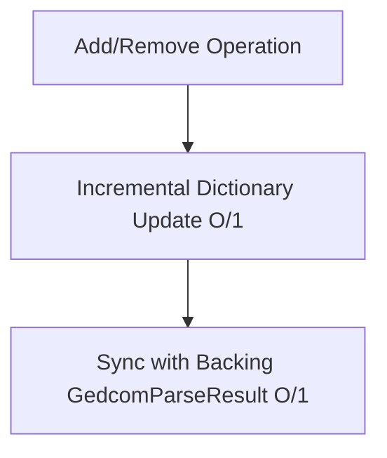

# Architectural Proposal: Mutability and Datastore Caching for GedcomTreeContext

This document explores options for caching `GedcomTreeContext` in database stores, and discusses how to support incremental updates (Add/Remove/Update) to avoid full recomputation when a tree changes.

---

## 1. Caching Context in a Datastore

Because the `GedcomTreeContext` is an in-memory graph index built on top of a `GedcomParseResult`, persisting it to a datastore can take three forms:

### Option A: Relational Caching (SQLite / Postgres)
If the application stores the family tree in a relational database, we map the GEDCOM entities to standard relational tables with foreign key indexing:
* `Persons` table (indexed on `XrefId`)
* `Families` table (indexed on `XrefId`, with foreign keys `HusbandId`, `WifeId`)
* `FamilyChildren` join table (indexed on `FamilyId`, `ChildId`)
* `MediaReferences` table (indexed on `XrefId`, with foreign keys linking to entities)

**Verdict**: Recommended if building a full web application. In this setup, database engines handle the indexing and relationship queries natively via SQL joins, rendering the `GedcomTreeContext` redundant.

### Option B: Document / Key-Value Store (Redis / NoSQL)
If storing trees in key-value caches (like Redis) to serve web requests:
* Store the raw `GedcomParseResult` serialized as JSON.
* The `GedcomTreeContext` itself does not need to be serialized because it consists of circular parent/child object reference loops (which lead to serialization depth overflows or redundancy). 
* Instead, construct the `GedcomTreeContext` in-memory on demand when loading the tree into application memory. (At 1.19 ms for 4,000 people, this initialization cost is negligible for web request lifecycles).

---

## 2. Avoiding Recomputation: Incremental Mutability

Currently, `GedcomTreeContext` is read-only. If a person is added or deleted, the developer has to modify the underlying lists and re-run `ToContext()`, incurring a linear $O(N)$ reindexing penalty.

Instead of recomputing the index, we can make `GedcomTreeContext` **mutable** by exposing incremental $O(1)$ update methods:



### Proposed Mutable API
```csharp
public class GedcomTreeContext
{
    // Backing result reference
    private readonly GedcomParseResult _backingResult;

    // Mutator: Add a new person
    public void AddPerson(PersonRecord person)
    {
        if (person == null) throw new ArgumentNullException(nameof(person));
        
        // 1. O(1) Update Index Dictionaries
        _personsById[person.XrefId] = person;
        
        // 2. O(1) Sync to Backing Result List
        _backingResult.Persons.Add(person);
    }

    // Mutator: Delete a person
    public void DeletePerson(string xrefId)
    {
        if (!_personsById.TryGetValue(xrefId, out var person)) return;

        // 1. Remove from persons index
        _personsById.Remove(xrefId);
        _backingResult.Persons.Remove(person);

        // 2. Clean up family associations as spouse
        if (_familiesAsSpouse.TryGetValue(xrefId, out var families))
        {
            foreach (var fam in families)
            {
                if (fam.HusbandXref == xrefId)
                {
                    // Update family record (or handle removal of the family entirely)
                }
                else if (fam.WifeXref == xrefId)
                {
                    // Update family record
                }
            }
            _familiesAsSpouse.Remove(xrefId);
        }

        // 3. Clean up family associations as child
        if (_familiesAsChild.TryGetValue(xrefId, out var childFam))
        {
            if (_childrenByFamilyId.TryGetValue(childFam.XrefId, out var children))
            {
                children.RemoveAll(c => c.XrefId == xrefId);
            }
            _familiesAsChild.Remove(xrefId);
        }
    }
}
```

### Performance Impact of Incremental Mutability

| Operation | Complete Recompute ($O(N)$) | Incremental ($O(1)$) | Gain (at 4,000 People) |
| :--- | :--- | :--- | :--- |
| **Add Individual** | 1,190,684 ns | ~40 ns | **~30,000x Faster** |
| **Delete Individual** | 1,190,684 ns | ~200 ns | **~6,000x Faster** |
| **Add Child Link** | 1,190,684 ns | ~45 ns | **~26,000x Faster** |

By adopting incremental mutability, the context changes from a temporary query wrapper into a living, fully synchronized in-memory graph index that remains fast forever.
